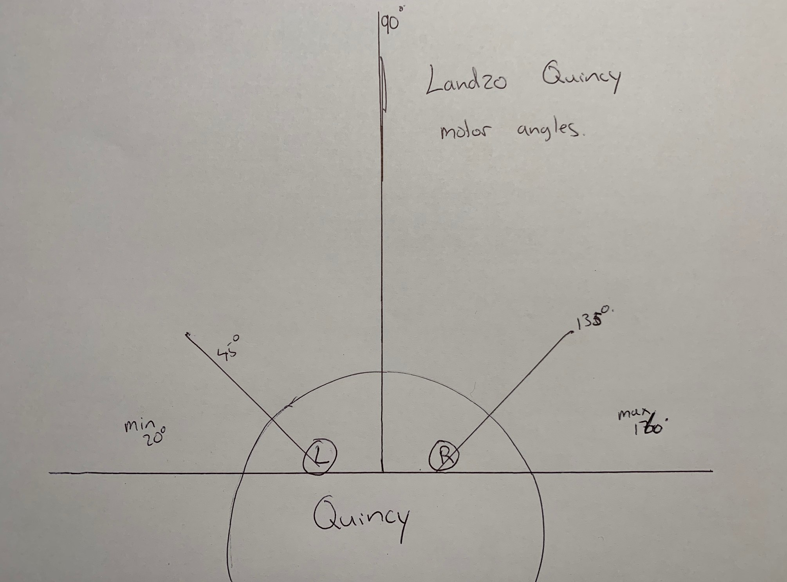

# Quincy
Opensource software for the Landzo Quincy Drawing Robot Artist

~~http://www.landzo.com/index.php?route=product/product&product_id=109~~
The company's website no longer seems to be active :-(

The Quinzy seems to look a lot like the WEDRAW Drawing Robot, which seems to use RFIF instead of Camera/QR codes. If anyone has one of these, interesting to find out if they use some file formats.

# Examples
Pickachu: https://www.instagram.com/p/CHYVtpEhsYd/

# Goal
The Quincy robot artist comes with a set of cards that is can teach you to draw and speaks only one language. (in my case English). The robot program is run from an included Micro SD card. After my child drew gloves and a Squirrel he wanted to learn how to draw pokemons. As this is not build-in, he asked his dad (me) to hack his robot and teach it how to draw pokemons :-)

# SD Card
The included SD card seems to hold all the possible drawing objects and how each program runs. In the root folder is a version.txt, this file is in Chinese GB18030 encoding. I have included the english translation of this file in the repository. There seems to be no copyright notice on the SD card and also no copyright notice is found in the included manuals.

# QRcode Cards
The cards have a QR code on them. The QR codes return: !A[object], !B[letter]000000, !B[number]000000

The object names directly refer to the folder name of the object on the SD Card.

Examples:
- !Azebra00
- !Amonkey0
- !Astrawbe

# .IAS file
In each folder is an .ias file. Which seems to be the main program file. This file is normal asci encoded.
Each line can have one of more commands.
P = Play
D = Draw
C = Capture, wait till certain card is shown
  a = play if answer correct
  b = play if answer is wrong
  c = draw the correct shape
  e = play end tips sound file
  
 # .snd file
 the .snd are the sound files. These are in the format of 16-bit PCM (Intel Endian) with a sample rate of 16.000Hz in mono.
 
 # .pmd file
 these .pmd files are the files that actually do the drawing. I am still working on decoding these. But they mainly seem to consist of 4 byte integers.

header:
- byte[1] = 001
- byte[4] = Number of segments as Little endian integer

Segment Block - Repeat for amount of segments:
- byte[4] = Number of points as Little endian integer
- Array size of number of points
    - byte[4] = Left Angle as Little endian float
    - byte[4] = Right Angle as Little endian float

